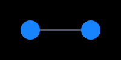
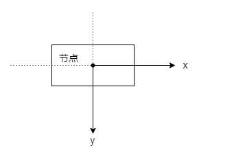
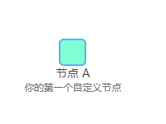
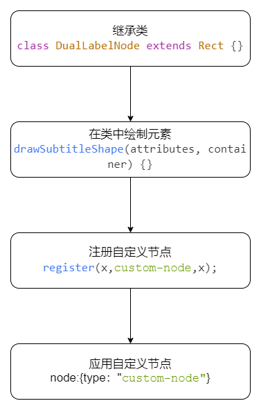
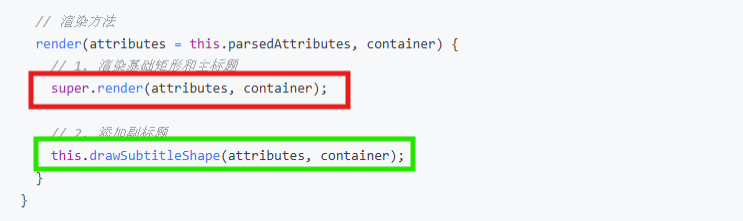
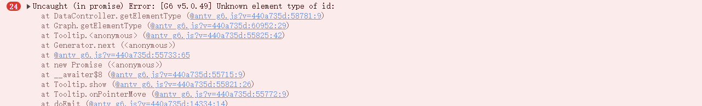
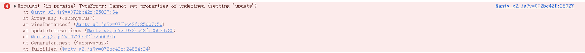
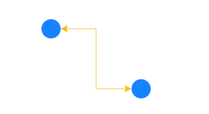

## 1.前言 ✍

&ensp;&ensp;G6 是一个图可视化引擎。它提供了图的绘制、布局、分析、交互、动画等图可视化能力。旨在为开发者提供一套简单易用、专业可靠、可高度定制的图可视化开发工具。（摘自官网）
<br/>
&ensp;&ensp;由于官方对于G6的基本使用提供了详细的介绍与示例，这里不再赘述。

```javascript
<template>
  <div>Use G6 in Vue</div>
  <div id="container"></div>//准备一个容器
</template>

<script setup>
import { onMounted } from 'vue';
import { Graph } from '@antv/g6';//引入图实例

onMounted(() => {
  const graph = new Graph({//实例化
    container: document.getElementById('container'),//容器
    width: 500,//宽度
    height: 500,//高度
    data: {//图的数据
      nodes: [//节点
        {
          id: 'node-1',
          style: { x: 50, y: 100 },
        },
        {
          id: 'node-2',
          style: { x: 150, y: 100 },
        },
      ],
      edges: [{ id: 'edge-1', source: 'node-1', target: 'node-2' }],//边  source:边的起始节点id；target:边的结束节点id
    },
    behaviors: ['drag-canvas', 'zoom-canvas', 'drag-element'],
    //行为
  });

  graph.render();//渲染图
});
</script>

```

&ensp;&ensp;你将得到这样一个图。
<br/>
&ensp;&ensp;当你了解了如何创建一个基本的G6图表后，我们开始进入正题。
<br/>


## 2.为什么需要自定义节点🤔

&ensp;&ensp;想象你在玩积木：G6 提供的默认节点（圆形、矩形等）就像 “标准积木块”，能拼简单的房子；但如果想拼一个 “带烟囱的城堡”，标准积木就不够用了 —— 这时候就需要自己动手做 “特殊积木”，这就是自定义节点。
<br/>
比如：
<br/>
●想在节点里放两张图片 + 一段彩色文字（像用户头像 + 等级 + 昵称）；
<br/>
●想在节点中内嵌图表（像状态环形分布图）；
<br/>
●想给节点加动态效果（hover 时出现气泡，点击时跳转）；
<br/>
此类需求超出了默认节点的能力范围，必须靠自定义节点实现。

## 3.三步创建你的第一个自定义节点

&ensp;&ensp;让我们从一个简单的例子开始 - 创建一个 带有主副标题的矩形节点：

### 3.1 编写自定义节点类

```javascript
import { Rect, register, Graph, ExtensionCategory } from "@antv/g6";

// 创建自定义节点，继承自 Rect
class CustomNode extends Rect {
  // 副标题样式
  getSubtitleStyle(attributes) {
    return {
      x: 0, //见注释1
      y: 45, //见注释1
      text: attributes.subtitle || "",
      fontSize: 12,
      fill: "#666",
      textAlign: "center",
      textBaseline: "middle",
    };
  }

  // 绘制副标题
  drawSubtitleShape(attributes, container) {
    const subtitleStyle = this.getSubtitleStyle(attributes);
    this.upsert("subtitle", "text", subtitleStyle, container); //见注释2
  }

  // 渲染方法
  render(attributes = this.parsedAttributes, container) {
    // 1. 渲染基础矩形和主标题
    super.render(attributes, container);

    // 2. 添加副标题
    this.drawSubtitleShape(attributes, container);
  }
}
```

注释：
① x,y：表示以节点的中心为原点的x、y坐标（见下图，箭头代表x、y的正方向）。可以将节点类比为开启相对定位的父元素，那么x,y就是节点内部的标题（子元素）的left和top
<br/>

<br/>
② this.upsert:

```javascript
this.upsert(id, type, attrs, container);
//id：字符串，元素的唯一标识
//type：字符串，要创建的图形元素类型（如'text'、'rect'、'circle'）
//attrs：对象，图形元素的属性（如位置x/y,颜色fill、文本内容text等）
//container：图形的分组对象（Group）,表示元素要添加到哪个分组中
```

this.upsert('subtitle', 'text', subtitleStyle, container)表示创建ID为'subtitle'的文本元素，并应用getSubtitleStyle准备好的样式。

### 3.2 注册自定义节点

使用 register 方法注册节点类型，这样 G6 才能识别你的自定义节点:

```javascript
register(ExtensionCategory.NODE, "custom-node", CustomNode);
```

register 方法需要三个参数：
<br/>
扩展类别：ExtensionCategory.NODE 表示这是一个节点类型
<br/>
类型名称：'custom-node'是我们给这个自定义节点起的名字，在配置中使用
<br/>
类定义：CustomNode 是我们刚刚创建的节点类

### 3.3 应用自定义节点

在图配置中使用自定义节点：

```javascript
const graph = new Graph({
  data: {
    nodes: [
      {
        id: "node1",
        style: { x: 100, y: 100 },
        data: {
          title: "节点 A", // 主标题
          subtitle: "你的第一个自定义节点", // 副标题
        },
      },
    ],
  },
  node: {
    type: "custom-node", //在此处应用自定义节点
    style: {
      fill: "#7FFFD4",
      stroke: "#5CACEE",
      lineWidth: 2,
      radius: 8,
      // 主标题样式
      labelText: (d) => d.data.title,
      labelFill: "#222",
      labelFontSize: 14,
      labelFontWeight: 500,
      // 副标题
      subtitle: (d) => d.data.subtitle,
    },
  },
});

graph.render();
```

🎊恭喜！你已经创建了第一个自定义节点。
<br/>
它看起来像这样：
<br/>

<br/>
让我们来总结一下：
<br/>


## 4.数据的流向

我们在创建G6的实例时，传入了图的数据。但是如何在自定义节点中拿到这些数据呢？G6提供了两种数据获取方式。

### 4.1 通过attributes参数获取

```javascript
class CustomNode extends Rect {
  render(attributes, container) {
    // attributes 包含了所有样式属性，包括数据驱动的样式
    console.log("当前节点的所有属性:", attributes);

    // 如果在 style 中定义了 name: (d) => d.data.name 见注释1
    // 那么可以通过 attributes.name 获取
    const customValue = attributes.customData;

    super.render(attributes, container);
  }
}
```

注释：
① 为什么用(d) => d.data.name
这是一个箭头函数，作用是 “动态将节点原始数据中的 name 字段，赋值给当前样式属性（这里是 style.name）”。
<br/>
●当 G6 渲染节点时，会自动为每个节点执行这个函数，并传入该节点对应的 d 对象。
<br/>
●这样就能实现 “不同节点根据自身数据显示不同样式”（比如不同节点显示各自的 name）。
<br/>
举例说明：
<br/>
节点数据

```javascript
nodes: [
  { id: "1", data: { name: "节点1" } },
  { id: "2", data: { name: "节点2" } },
];
```

配置 style: { name: d => d.data.name } 后：
<br/>
节点 1 的 style.name 会被设为 '节点1'
<br/>
节点 2 的 style.name 会被设为 '节点2'
<br/>
总结：d 是当前节点的 “信息载体”，通过 d.data 可以访问节点的原始数据，从而实现样式的动态配置。

### 4.2 通过this.context.graph获取原始数据

```javascript
class CustomNode extends Rect {
  // 便捷的数据获取方法
  get nodeData() {
    return this.context.graph.getNodeData(this.id);
  }

  get data() {
    return this.nodeData.data || {};
  }

  render(attributes, container) {
    // 获取节点的完整数据
    const nodeData = this.nodeData;
    console.log("节点完整数据:", nodeData);

    // 获取 data 字段中的业务数据
    const businessData = this.data;
    console.log("业务数据:", businessData);

    super.render(attributes, container);
  }
}
```

## 5. 自定义节点Q & A

❓super.render(...)可以和this.drawSubtitleShape(...)交换位置吗？
<br/>


✅ 不可以。为了确保 父类先完成基础初始化，super.render(...) 需要放在 this 自定义逻辑之前，为子类的自定义操作（如 drawSubtitleShape）提供必要的环境和依赖。如果颠倒顺序，可能导致父类未初始化的资源无法被子类访问，引发图形绘制失败或数据错误。这是继承场景中 “先父后子” 初始化顺序的必然要求。

❓文字溢出显示省略号hover时出现气泡如何实现？

✅ 见下方代码。这里需要注意的是，在this.upsert(...)设置元素标识时（即"nodeName"）,切勿占用G6源码中的关键字。例如："label"。下面我们具体分析一下：
当你在节点中使用 key: 'label' 调用 upsert 时，看似是在创建自定义文本图形，但 G6 内部会自动生成一个内置 label 图形（用于处理节点默认标签逻辑），且这个内置图形会覆盖你手动创建的 key: 'label' 图形。
<br/>
内置label图形没有 isOverflowing()方法，因此，即使你通过 shapeMap["label"] 拿到了图形实例，调用 isOverflowing() 时也会因 “方法不存在” 报错。

```javascript
//自定义类中
drawNameShape(attributes,container){
    const nameStyle = {
        textOverflow: "ellipsis",
        wordWrap: false,
        wordWrapWidth:80
    }
    this.upsert('nodeName', 'text', nameStyle, container);
}

//图配置中
const graph = new Graph({
 ...
     plugins:[
         {
             type:"tooltip",
             enable:(e,item) => { //控制气泡是否显示
                 let isOverflowing = e?target?.shapeMap["nodeName"]?.isOverflowing() //判断文字是否溢出
                 if(isOverflowing) return true
              }
              getContent:(e,items) => { //设置气泡内容
                 let result = items[0].name
                 return result
              }
         }
     ]
})
```

❓如何拿到节点内文字的实际宽度？

✅ 见下方代码

```javascript
drawNameShape(attributes,container){
    const nameStyle = this.getNameStyle(attributes,container);
    const testShape =     this.upsert("nodeName",GText,nameStyle,container);
    //通过getBBox()获取文本实际宽度
    const textBBox = textShape.getBBox();
    const textWidth = textBBox.width()
    console.log(`文本宽度:${this.textWidth}px`)
}
```

❓为什么使用了tooltip插件后，鼠标移入节点报错（见下图），如何解决？
<br/>


✅ 见下方代码。问题的根源在于 this.upsert返回的元素没有id值。afterCreate 回调通过手动指定图形 id 为节点的唯一 ID，解决了 G6 因 “图形 ID 重复、无效或关联失败” 导致的识别错误。核心是利用节点 ID 的唯一性，确保图形 ID 可被 G6 正确识别和管理。

```javascript
drawImageShape(attributes, container) {
    this.upsert(
      "image",
      Image,//错误常见于绘制image类型
      {
        x: this.data.type == "icon" ? -1 : -84,
        size: this.data.type == "icon" ? 48 : 16,
        src: this.data.type == "app" ? UserApp: "",
      },
      container,
      {
        afterCreate: shape => {
          shape.id = this.id;
        },//添加afterCreate回调，手动指定id
      },
    );
  }

```

❓在自定义节点内嵌套G2饼图报错如何解决？
<br/>


✅见下方代码。核心问题是试图给一个 undefined 变量的 update 属性赋值，而这个变量未被正常初始化。属于G2内部问题，从源码中可推断。

```javascript

drawPieShape(attributes, container) {
    const [width, height] = this.getSize();

    const group = this.upsert(
      "chart-container",
      Circle,
      {
        x: width / 2 - 80,
        y: -height / 2 - 15,
        width: 95,
        height: 95,
      },
      this.shapeMap.key,
      {
        afterCreate: shape => {
          shape.id = this.id;
        },
      },
    );
    group.isMutationObserved = true;

    renderToMountedElement(
      {
        width: 95,
        height: 95,
        data: this.data.pieData,
        autoFit: true,
        type: "interval",
        encode: {
          y: "value",
          color: "color",
        },
        scale: { color: { type: "identity" } },
        transform: [{ type: "stackY" }],
        coordinate: { type: "theta", outerRadius: 0.8, innerRadius: 0.5 },
        legend: false,
        tooltip: false,
      },
      {
        group,
        library: stdlib(),
        //处理 Cannot set properties of undefined (setting 'update')报错
        externals: {},
      },
    );
  }
```

## 6.使用 Vue 定义节点

&ensp;&ensp;前序章节已介绍 G6 原生自定义节点的实现。但在 Vue 项目中，这种方式存在局限：无法复用 Vue 组件、节点状态脱离响应式体系、样式需适配 G6 配置格式。
为解决这些问题，G6 提供了 g6-extension-vue 扩展，支持以Vue 组件的形式定义节点——这意味着我们可以用熟悉的 props 接收节点数据、用 computed 管理节点状态、用 <style scoped> 隔离节点样式，甚至直接引入 Vue UI 库组件（如 Button、Input）构建节点内部结构。

### 6.1 安装依赖

```javascript
# 使用npm
npm install g6-extension-vue
# 使用yarn
yarn add g6-extension-vue
# 使用pnpm
pnpm add g6-extension-vue

```

### 6.2 注册Vue节点类型

```javascript
import { ExtensionCategory, register } from "@antv/g6";
import { VueNode } from "g6-extension-vue";

register(ExtensionCategory.NODE, "vue-node", VueNode);
```

register 方法需要三个参数：
<br/>
扩展类别：ExtensionCategory.NODE 表示这是一个节点类型
<br/>
类型名称：'vue-node'是我们给这个自定义节点起的名字，在配置中使用
<br/>
类定义：VueNode 是 g6-extension-vue 导出的实现类

### 6.3 定义业务组件

定义一个简单的 Vue 组件作为节点的内容（以模板写法为例）：

```javascript
/* MyVueNode 组件 */
<template>
  <div>vue node</div>
</template>
```

### 6.4 使用组件

在图配置中使用自定义的 Vue 节点。通过在图配置中指定节点类型和样式，来使用自定义的 Vue 组件（以模板写法为例）。

```javascript
const graph = new Graph({
  ...
  node: {
    type: 'vue-node',//指定节点类型为vue-node
    style: {
      component: () => h(MyVueNode),//定义节点的Vue组件内容
    },
  },
});

graph.render();
```

## 7.连接节点-自定义边的绘制

&ensp;&ensp;节点是图的基础 “个体”，但节点之间的关系（如依赖、流向、层级）需要通过边来表达。
G6 提供了直线、折线、曲线等内置边类型，但在复杂场景中（如脑图的直角转弯边、流程图的条件分支边、动态变化的流量边），内置边往往难以满足个性化需求。像节点一样，边也可以“随心所欲”的绘制——这就是自定义边。当然，自定义边的绘制和自定义节点如出一辙。

### 7.1了解边的基本构成

key：边的主图形，表示边的主要形状，例如直线、折线等；
<br/>
label：文本标签，通常用于展示边的名称或描述；
<br/>
arrow：箭头，用于表示边的方向；
<br/>
halo：主图形周围展示光源效果的图形；

### 7.2编写自定义类

```javascript
import { BaseEdge } from '@antv/g6';
import type { BaseEdgeStyleProps } from '@antv/g6';

class MyLineEdge extends BaseEdge {
  // 定义边的样式，可以添加或覆盖默认样式
  protected getKeyStyle(attributes: Required<BaseEdgeStyleProps>) {
    // 调用父类方法获取基础样式，然后添加自定义样式
    return { ...super.getKeyStyle(attributes), lineWidth: 2, stroke: '#A4D3EE' };
  }

  // 实现抽象方法：定义边的路径
  // 这是 BaseEdge 的抽象方法，所有子类必须实现
  protected getKeyPath(attributes) {
    // 获取源节点和目标节点
    const { sourceNode, targetNode } = this;

    // 获取节点的位置坐标
    const [x1, y1] = sourceNode.getPosition();
    const [x2, y2] = targetNode.getPosition();

    // 返回SVG路径数组，定义从起点到终点的直线
    return [
      ['M', x1, y1],
      ['L', x2, y2],
    ];
  }
}
```

### 7.3注册自定义边

使用register方法注册边类型，这样G6才能识别你的自定义边

```javascript
import { ExtensionCategory } from "@antv/g6";

register(ExtensionCategory.EDGE, "custom-edge", customEdge);
```

register 方法需要三个参数：
<br/>
扩展类别：ExtensionCategory.EDGE 表示这是一个节点类型
<br/>
类型名称：'custom-edge'是我们给这个自定义节点起的名字，在配置中使用
<br/>
类定义：CustomEdge 是我们刚刚创建的节点类

### 7.4应用自定义边

在图的配置中，通过设置 edge.type 来使用我们的自定义边：

```javascript
const graph = new Graph({
  container: "container",
  data: {
    nodes: [
      { id: "node1", style: { x: 100, y: 100 } },
      { id: "node2", style: { x: 300, y: 150 } },
    ],
    edges: [{ source: "node1", target: "node2" }],
  },
  node: {
    style: {
      fill: "#7FFFD4",
      stroke: "#5CACEE",
      lineWidth: 2,
    },
  },
  edge: {
    type: "custom-edge",
    style: {
      zIndex: 3,
    },
  },
});

graph.render();
```

### 7.5从简单到复杂

&ensp;&ensp;在所有边的形态中，自定义路径的折线边无疑是最基础也最常用的场景：小到树形图中父子节点的层级连接，大到拓扑图中多节点的分支关系，折线边凭借其规整的转向和明确的路径，成为承载 “层级”“方向”“分支” 等语义的最佳选择。

```javascript
import { Graph, register, BaseEdge, ExtensionCategory } from "@antv/g6";
//编写自定义类
class MyPolylineEdge extends BaseEdge {
  getKeyPath(attributes) {
    const [sourcePoint, targetPoint] = this.getEndpoints(attributes);

    return [
      ["M", sourcePoint[0], sourcePoint[1]],
      ["L", (targetPoint[0] + sourcePoint[0]) / 2, sourcePoint[1]],
      ["L", (targetPoint[0] + sourcePoint[0]) / 2, targetPoint[1]],
      ["L", targetPoint[0], targetPoint[1]],
    ]; //见注释
  }
}
//注册自定义边
register(ExtensionCategory.EDGE, "my-polyline-edge", MyPolylineEdge);
//实例化G6
const graph = new Graph({
  container: "container",
  height: 200,
  data: {
    nodes: [
      {
        id: "node-0",
        style: {
          x: 100,
          y: 50,
          ports: [{ key: "right", placement: [1, 0.5] }],
        },
      },
      {
        id: "node-1",
        style: {
          x: 250,
          y: 150,
          ports: [{ key: "left", placement: [0, 0.5] }],
        },
      },
    ],
    edges: [{ source: "node-0", target: "node-1" }],
  },
  edge: {
    type: "my-polyline-edge", //应用自定义边
    style: {
      startArrow: true,
      endArrow: true,
      stroke: "#F6BD16",
    },
  },
  behaviors: ["drag-element"],
});

graph.render();
```

它看起来像这样：
<br/>

注释：
<br/>
SVG路径指令：
<br/>
SVG中绘制图形的核心是path标签，它通过一系列指令描述图形轨迹。这段代码返回的数组就是一组SVG路径指令，其中：
<br/>
['M'，x，y]：移动指令，表示将画笔"移动"到（x，y）位置，但不绘制线条（起点）。
<br/>
['L'，x，y]：连线指令，表示从当前画笔位置绘制一条直线到（x，y）位置（画线段）。
<br/>
这组指令的执行逻辑是：先移动到起点，再通过多次连线形成多段直线，最终组合成折线。
<br/>
最终效果：

```javascript
起点 (x1,y1) → 水平中点 ((x1+x2)/2, y1) → 垂直中点 ((x1+x2)/2, y2) → 终点 (x2,y2)
```
